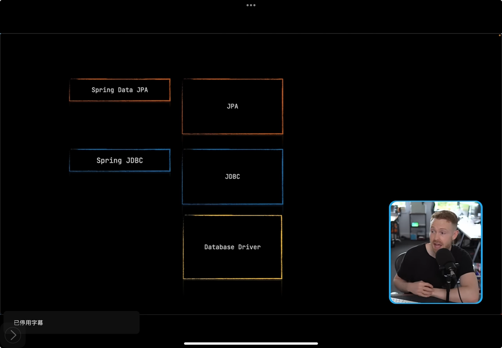

👉 **JDBC、Spring JDBC、JPA、Spring Data JPA 和数据库驱动之间的“关系网”**，它们是怎么互相合作的

---

我们来用一个非常形象的\*\*“送信”比喻\*\*，就像你要把一封信送到远方的朋友（数据库）手里，你可以选择不同的方式：自己跑过去、找邮局、坐飞机……下面是它们的角色：

---

### 🌟 总目标：

把 Java 程序的数据（比如学生信息）**存到数据库** 或者 **从数据库里读出来**！

---

### 💡 它们的关系图：

```plaintext
Java 程序
   ↓ 使用
Spring Data JPA
   ↓ 使用
   JPA 规范（API）-- JPA is how you query (查数据) using Java objects
   ↓ 使用
Hibernate（或其他 JPA 实现）
   ↓ 使用
JDBC（数据库通用电话线）-- JDBC is how you connect to the database
   ↓ 使用
Database Driver（不同数据库的车轮）
   ↓ 最终连到
数据库（MySQL、PostgreSQL 等）
```

---

### 🧩 每个角色在做什么？

| 名称              | 比喻      | 它的工作                                 | 它依赖谁               |
| --------------- | ------- | ------------------------------------ | ------------------ |
| JDBC            | 电话线     | 发送 SQL 到数据库，最基本的通信方式                 | 需要数据库驱动            |
| 数据库驱动           | 电话卡/翻译机 | 把 JDBC 的命令翻译成特定数据库能听懂的语言（如 MySQL 语法） | 是 JDBC 的“助手”       |
| Spring JDBC     | 快捷拨号电话  | 把 JDBC 简化，写更少代码做同样的事                 | 用 JDBC             |
| JPA             | 通用规则    | 定义一套操作数据库的方法，不管底层是什么数据库              | 用 JDBC + 驱动        |
| Hibernate       | 会动的邮递员  | JPA 的实现者，自动把 Java 对象和数据库表对上号         | 用 JDBC + 驱动        |
| Spring Data JPA | 自动邮递公司  | 帮你省事，连 JPA 代码都不用写，查找和保存数据都能自动完成      | 用 JPA（和 Hibernate） |

---

### ✅ 最终目的：

让你在 Java 程序里只写简单的代码，比如：

```java

studentRepository.save(new Student("Fia", 10));
```

🌟 这些工具们就会自己合作完成：

1. Spring Data JPA 把 save 方法调用交给 Hibernate；
2. Hibernate 根据 JPA 规则生成 SQL；
3. JDBC 把 SQL 语句发给数据库；
4. 驱动帮忙连接数据库；
5. 数据库存下数据，工作完成！

---

### 🧠 一句话总结：

> 你只管写 Java 类和调用方法，Spring Data JPA + JPA + Hibernate + JDBC + 驱动，就能**自动帮你把数据存到数据库**里了！

---


## database driver（数据库驱动）

🚗 它就像一辆车，带着 Java 程序去访问数据库。

比如你用的是 MySQL，就需要 `mysql-connector-java` 这个驱动。
它通常是一个 `.jar` 文件，加在项目里就能用了。

---


## JDBC 是什么？

**JDBC** 全称是 **Java Database Connectivity**，也就是 **Java 数据库连接工具**。
👉 想象一下：JDBC 就像是一根 **电话线**，把你的 Java 程序和数据库连接起来，这样 Java 程序就可以去数据库里“打电话”获取数据啦！

💡 JDBC 会做什么事：

* 打开数据库的门（连接）
* 发送 SQL 命令
* 收到数据库的回答（结果）
* 关闭连接

---

## 二、Spring JDBC 是什么？

**Spring JDBC** 是 Spring 提供的一套工具，它在 JDBC 上做了一些“包装”，让你写更少的代码就能完成相同的事！

👉 举个例子：
用普通的 JDBC 写一个查询，可能要写 10 行代码。
用 Spring JDBC，只要 3 行！是不是很像自动削苹果的机器？又快又安全！

---

## JPA 是什么？

**JPA** 是 **Java Persistence API**，翻译过来就是“Java 数据保存的规则”。

但注意：JPA 本身只是一种“标准”，就像交通规则一样，具体开车的工具是别人写的（比如 Hibernate、EclipseLink）。

JPA 做的事情就是：
✅ 不用写 SQL，直接用 Java 类操作数据库！

👉 想象一下：
你有一个 Java 类叫 `Student`，JPA 会帮你自动把它对应到数据库中的 `student` 表里！

---

## 二 Spring Data JPA 是什么？

这是 Spring 给我们准备的一套工具，它 **基于 JPA**，让数据库操作变得超级简单！

你甚至只需要写一个接口，不写一行 SQL，就能查数据、存数据！

例如👇

```java
public interface StudentRepository extends JpaRepository<Student, Long> {
    // 自动生成 SQL，不用你写！
    List<Student> findByName(String name);
}
```

是不是像魔法一样？🌟
Spring Data JPA 会自动生成这些查询语句！

---

## 总结对比表：

| 名字              | 像什么？   | 做什么？                           | 需不需要写 SQL？ |
| --------------- | ------ | ------------------------------ | ---------- |
| JDBC            | 电话线    | Java 连接数据库、发送 SQL、获取结果         | ✅ 需要       |
| Spring JDBC     | 自动拨号电话 | 简化 JDBC，写更少代码                  | ✅ 需要       |
| JPA             | 通用规则   | 把 Java 类和数据库表连接起来              | ❌ 通常不需要    |
| Spring Data JPA | 魔法接口工具 | 自动生成很多数据库操作，不写 SQL 也能查找        | ❌ 不需要      |
| Database Driver | 车轮+方向盘 | 帮 Java 程序连接数据库，比如 MySQL Driver | -          |

---
