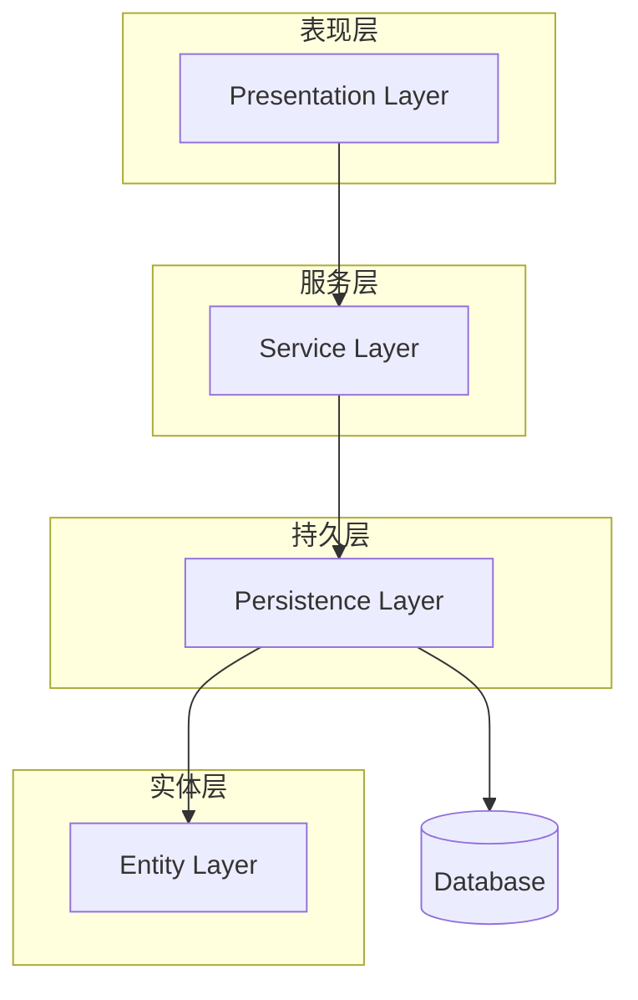

# 分层架构中 Entity、Service、Persistence、Presentation 等层的职责、互动方式以及设计理念**的说明，并已总结为 Markdown 格式的学习笔记供你保存和复习：

---

# 💡 分层架构责任 & 层间交互总结笔记

## 🧱 常见四层结构

1. **Presentation Layer（表现层 / Controller 层）**
2. **Service Layer（服务层 / 业务逻辑层）**
3. **Persistence Layer（持久层 / Repository 层）**
4. **Domain / Entity Layer（实体层 / 模型层）**

---

## 1️⃣ Entity Layer（实体层）

* **定义：** POJO类（Plain Old Java Object），包含数据字段与业务相关属性。
* **作用：** 表示业务对象，如 `User`, `Order`, `Product` 等。
* **交互对象：**

    * 被 `Service Layer` 使用来执行业务逻辑。
    * 被 `Persistence Layer` 映射为数据库表（通常通过 JPA/Hibernate）。
* **📌职责：**

    * 只负责存储状态和必要的验证。
    * 不包含数据库操作或业务流程控制。

---

## 2️⃣ Persistence Layer（持久层 / Repository）

* **定义：** 用于与数据库交互的层，通常使用接口 + ORM 框架（如 Spring Data JPA）。
* **作用：** 将实体保存、查询、更新、删除。
* **交互对象：**

    * 接收 `Service Layer` 的调用。
    * 调用底层 ORM 或 SQL 实现与数据库的通信。
* **📌职责：**

    * 隐藏数据库细节。
    * 提供简洁的接口：`save()`, `findById()`, `delete()` 等。
* **变化后为何不影响业务？**

    * 因为通过接口抽象，与上层解耦。
    * 改换数据库（MySQL → MongoDB）时只需替换实现，Service 层不需要改动。

---

## 3️⃣ Service Layer（服务层 / 业务逻辑层）

* **定义：** 编排业务逻辑的层。
* **作用：** 接收 Controller 请求，调用多个 Repository 或外部服务完成业务。
* **交互对象：**

    * 接收 `Controller（表现层）` 的调用。
    * 调用 `Repository（持久层）` 或远程 API。
* **📌职责：**

    * 聚合逻辑、控制事务、校验数据。
    * 保持业务逻辑独立，使其与表现层、数据库技术无关。

---

## 4️⃣ Presentation Layer（表现层 / Controller）

* **定义：** 接收 HTTP 请求的入口（如 `@RestController`）。
* **作用：** 解析请求参数，调用 Service 返回结果。
* **交互对象：**

    * 调用 `Service Layer`。
    * 不直接访问 Repository。
* **📌职责：**

    * 只负责接收请求、返回响应（JSON、HTML）。
    * 不应包含任何业务逻辑。

---

## ❗ 为什么不推荐 Controller 直接访问 Repository？

| 原因            | 解释                                       |
| ------------- | ---------------------------------------- |
| 🧠 **业务逻辑混乱** | 表现层不应处理复杂的业务流程，否则逻辑难以维护。                 |
| 🔁 **重复代码多**  | 不同 Controller 可能会重复同样的数据验证、处理流程。         |
| ❌ **无法重用逻辑**  | 无法让不同的调用（Web、API、Job）复用统一业务逻辑。           |
| 🔄 **耦合紧密**   | Controller → Repository → DB，任何一环变化影响全局。 |
| 🧪 **难以测试**   | 单元测试时难以模拟复杂业务，只能做集成测试。                   |

---

## ✏️ 总结：各层互动关系图




## ✅ 好处总结（遵循分层架构）

| 好处     | 说明                           |
| ------ | ---------------------------- |
| 🔄 解耦  | 每层职责清晰，易于修改和扩展。              |
| 🧪 易测试 | 可以对 Service 层进行单元测试，无需真实数据库。 |
| 🔧 可维护 | 结构清晰，易于团队协作与代码阅读。            |
| ♻️ 易重构 | 可以替换数据库或 Web 框架而不影响核心业务逻辑。   |

---
当你想从 REST API 换成其他 API（比如 GraphQL、gRPC、WebSocket 等）的时候：

你**不需要改变**：

* ✅ **Service Layer（服务层）**：业务逻辑保持不变
* ✅ **Entity Layer（实体层）**：业务数据结构保持不变

你**只需要改变**：

* 🔄 **Presentation Layer（表现层 / Controller）**：接收请求和返回响应的方式会变（比如从 `@RestController` 改为 GraphQL Resolver 或 gRPC Handler）

---

### 📝 套用句子填空版：

> 当我想从 REST API 换成其他 API 的时候，
> 我不需要改变 **Service 层** 和 **Entity 层**，
> 只需要改变 **Presentation 层**。

---
##  太好了，Fia！我们来做一个**超简单又说明白的 Spring Boot 项目小例子**，让你一步步看懂：

---

## 🎯 目标：做一个糖果盒子程序 🍬

我们要让 Spring 自动准备糖果，然后把糖果放进糖果盒子里！

---

## 🧰 第一步：创建一个 Spring Boot 项目

你可以用 IntelliJ IDEA 创建一个新的 Spring Boot 项目，勾选：

* Spring Web ✅
* Spring Boot 版本随便最新版就好

---

## 🗂 第二步：创建配置类，准备糖果

我们告诉 Spring，要准备哪些糖果（Bean），就像之前说的“糖果房间”。

```java
// CandyConfig.java
package com.example.demo;

import org.springframework.context.annotation.Bean;
import org.springframework.context.annotation.Configuration;

@Configuration // 表示这是一个“配置类”
public class CandyConfig {

    @Bean // 告诉 Spring：这个方法返回的是 Bean，要自动放进柜子里
    public String chocolate() {
        return "🍫 巧克力";
    }

    @Bean
    public String lollipop() {
        return "🍭 棒棒糖";
    }
}
```

### 🧠 Spring 会做什么？

启动时，它会自动运行这些 `@Bean` 方法，把巧克力和棒棒糖放进容器。

---

## 📦 第三步：创建一个糖果盒子类

这个类会“需要”糖果，Spring 会自动把糖果送过来。

```java
// CandyBox.java
package com.example.demo;

import org.springframework.stereotype.Component;

@Component // 表示：这是一个需要被Spring管理的类
public class CandyBox {

    private final String chocolate;
    private final String lollipop;

    // Spring 会自动把 Bean 注入进来（构造器注入）
    public CandyBox(String chocolate, String lollipop) {
        this.chocolate = chocolate;
        this.lollipop = lollipop;
    }

    public void showCandies() {
        System.out.println("糖果盒里有：" + chocolate + " 和 " + lollipop);
    }
}
```

---

## 🚀 第四步：运行程序并展示糖果盒

我们修改 `DemoApplication.java` 来使用我们的糖果盒子：

```java
// DemoApplication.java
package com.example.demo;

import org.springframework.beans.factory.annotation.Autowired;
import org.springframework.boot.CommandLineRunner;
import org.springframework.boot.SpringApplication;
import org.springframework.boot.autoconfigure.SpringBootApplication;

@SpringBootApplication
public class DemoApplication implements CommandLineRunner {

    @Autowired
    private CandyBox candyBox;

    public static void main(String[] args) {
        SpringApplication.run(DemoApplication.class, args);
    }

    // 当程序启动时会自动执行这个方法
    @Override
    public void run(String... args) throws Exception {
        candyBox.showCandies(); // 显示糖果
    }
}
```

---

## ✅ 最终结果

运行程序后，你会在控制台看到：

```
糖果盒里有：🍫 巧克力 和 🍭 棒棒糖
```

---

## 🧠 再次总结逻辑：

| 步骤   | 做了什么                                  | Spring 是怎么工作的 |
| ---- | ------------------------------------- | ------------- |
| 配置糖果 | 在 `@Configuration` 类里，用 `@Bean` 准备好糖果 | 把返回的值放进容器     |
| 创建盒子 | 在 `CandyBox` 里“需要”这些糖果                | 自动把糖果放进盒子     |
| 启动程序 | 在 `run()` 方法里用糖果盒展示内容                 | 程序自动运行，显示结果   |

---

## 🎓 小学生风格的比喻记住：

> Spring 像一个智能厨房（容器），你写食谱（@Bean）它帮你做好吃的东西，然后你要吃的时候（用类）它就端上来了（依赖注入）！

---

如果你想加功能，比如不同的盒子、不同的糖果，或者用 web 页面展示这些，我也可以继续教你做！想继续吗？🍭

